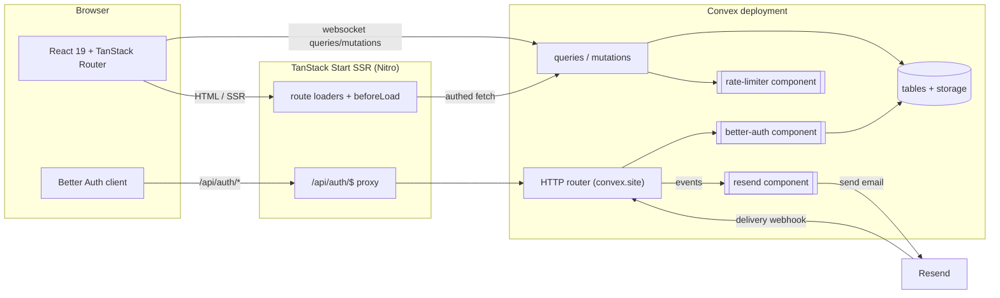
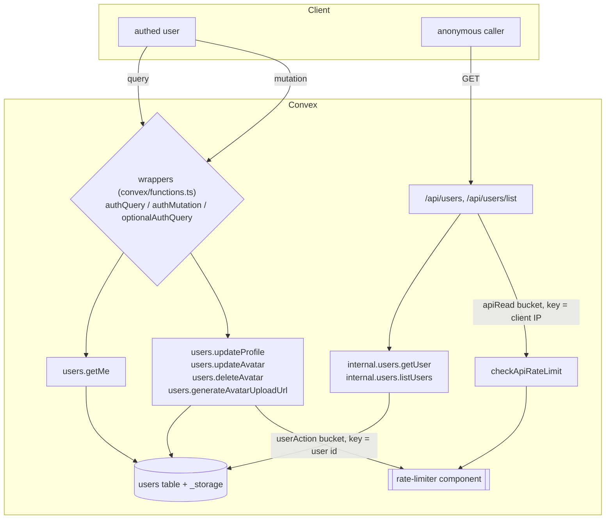
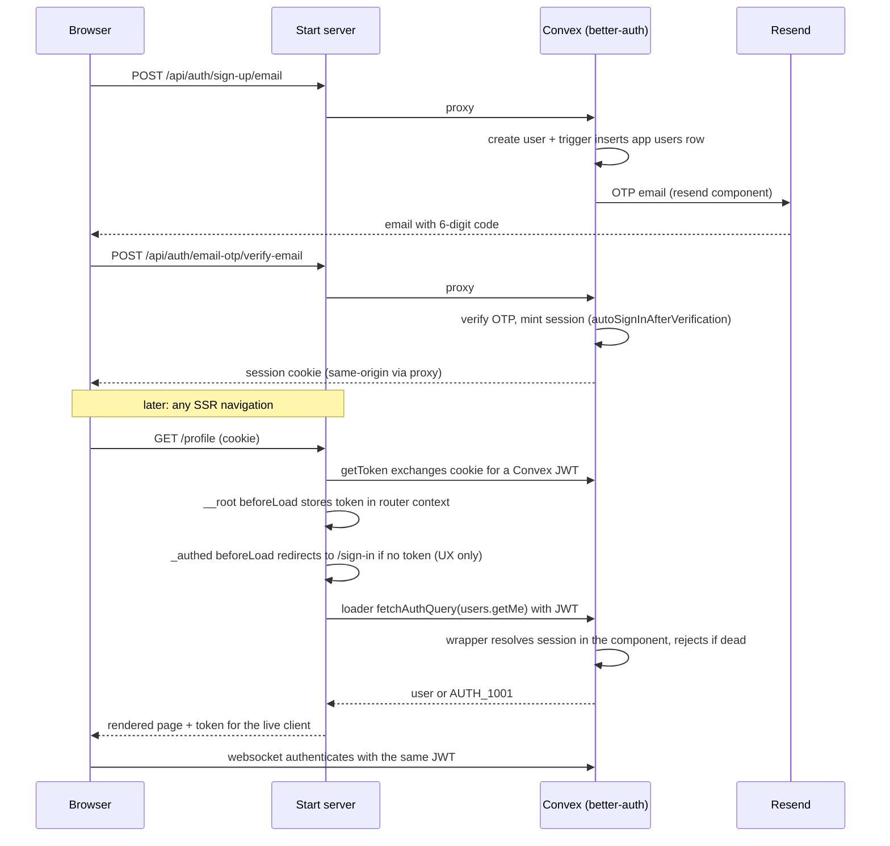
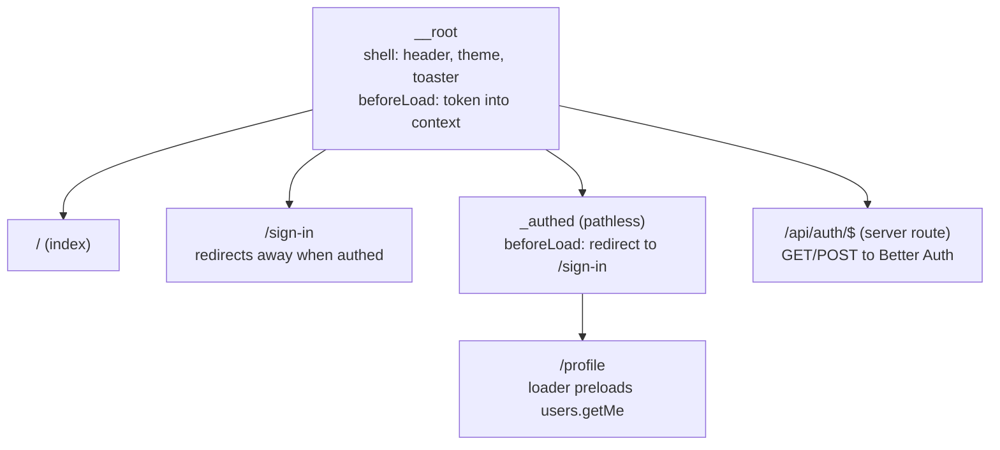

# Architecture

System-level views of how the pieces connect. Implementation detail lives in the source,
starting from `convex/functions.ts` (the wrapper layer) and `src/routes/__root.tsx`
(the app shell).

## Overall

Three runtimes plus one external service. The browser talks to the Start server for
HTML and auth, and to Convex directly for data. Convex owns all state and secrets.

- The browser never holds secrets. `VITE_*` vars are public URLs baked at build time.
- `BETTER_AUTH_SECRET`, `RESEND_API_KEY`, `SITE_URL`, and friends live on the Convex
  deployment only.
- The auth proxy keeps browser-to-auth traffic same-origin, so no CORS on the auth
  routes. The CORS allowlist (`convex/origins.ts`) applies to the public `/api/*`
  endpoints only.

## Data flow and rate limiting

Every write path consumes a rate-limit bucket before touching data. Reads over the
websocket are Convex-reactive and unmetered. Anonymous reads go through the HTTP API,
which meters by IP.

- `getUser` and `listUsers` are `internal.*`. Their only entry is the rate-limited HTTP
  route, so the IP meter cannot be bypassed over the websocket.
- Better Auth applies its own HTTP rate limits to the auth routes (sign-in, sign-up,
  OTP sends) in `convex/auth.ts`. The rate-limiter component covers app endpoints.
- Avatar bytes go browser to Convex storage directly via a short-lived upload URL
  minted by `generateAvatarUploadUrl` (itself rate limited).

## Auth flow

Sign-up through Convex-side enforcement. The `_authed` route gate is UX only. The
authority is the wrapper layer inside Convex, which resolves the session from the
better-auth component on every call.

- Password sign-in, username sign-in, and OTP sign-in all land on the same session
  machinery. OTP sign-in cannot create accounts (`disableSignUp`).
- Session cookies live on the app origin because the browser only ever talks to
  `/api/auth/*` on the Start server.
- Every Convex function that needs a user goes through
  `requireAuthenticatedUser` / `safeGetAuthenticatedUser`, which validate the session
  against the better-auth component's tables on each call. A revoked session fails
  server-side regardless of what the client claims.

## Route tree

- `defaultPreload: "intent"` preloads route code and loaders on hover/focus.
- `routeTree.gen.ts` is generated by the router plugin. Do not edit it.
