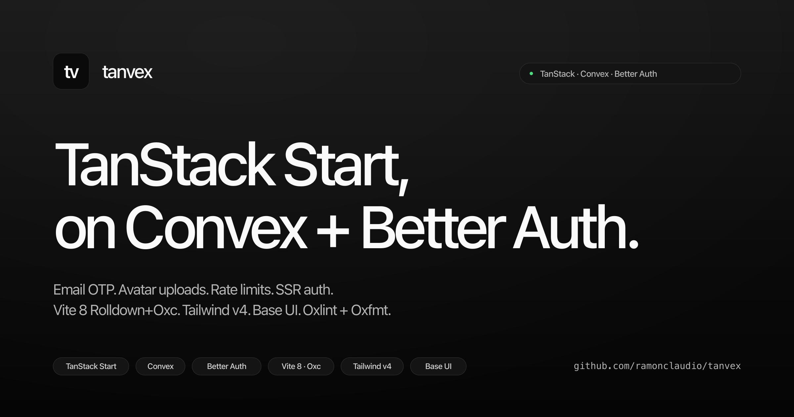

# tanvex

[](https://opensource.org/licenses/MIT)
[](https://tanvex-demo.vercel.app)



Every TanStack Start starter on GitHub ships last year's choices, and most don't ship auth at all. I kept scaffolding the same Convex + Better Auth + shadcn setup across projects, so I pulled both halves into one template. Clone, one-command setup, you're in dev mode.

Email + password auth with username sign-in and OTP verification through Resend. User profiles with avatar uploads to Convex storage. Rate limits on auth and API endpoints. SSR auth that works during server render. On top of Vite 8 with Rolldown+Oxc, Tailwind v4, shadcn/ui `base-luma` on Base UI `@base-ui/react` primitives, Oxlint and Oxfmt from the Oxc toolchain.

TanStack Start + Convex + Better Auth + React 19 + TypeScript 6 + Tailwind v4 + Zod v4. Runtime-agnostic: setup, daily workflow, and CI all run under bun, pnpm, npm, or yarn. The `scripts/_run.mjs` launcher picks bun -> tsx -> npx tsx automatically.

## Install

Needs Node 20+ or [Bun](https://bun.sh), a [Convex](https://convex.dev) account (free tier works), and a [Resend](https://resend.com/api-keys) API key (`re_...`, free tier is 3k/month).

```bash
git clone https://github.com/ramonclaudio/tanvex.git
cd tanvex
bun install         # or pnpm install, npm install, yarn install
bun run setup       # or pnpm setup, npm run setup, yarn setup
bun run dev         # or pnpm dev, npm run dev, yarn dev
```

Open [http://localhost:3000](http://localhost:3000). Sign up with a real email, you'll get an OTP from Resend.

For local Convex via Docker instead of cloud:

```bash
bun run setup:local
```

## What `setup` does

Wipes `node_modules`, lockfile, build artifacts, caches, and generated files. Reinstalls deps with the detected package manager. Runs `convex dev` which opens browser login on first run, creates a project, writes `CONVEX_DEPLOYMENT` and `VITE_CONVEX_URL` to `.env.local`, pushes functions, regenerates types. Auto-generates `BETTER_AUTH_SECRET`. Prompts for your Resend key, sender address, and app name.

Re-running setup does not rotate existing Convex env vars. For one-off changes use `npx convex env set NAME VALUE`.

Scripts: `setup`, `setup:local` (Docker), `setup:fresh` (new deployment). Flags: `--version`, `--help`.

## Stack

- TanStack Start + TanStack Router with file-based routing
- Convex 1.37 backend with `@convex-dev/better-auth`, `@convex-dev/rate-limiter`, `@convex-dev/resend`
- Better Auth 1.6.9 with the `emailOTP` and `username` plugins
- Vite 8 with Rolldown and Oxc plugins
- Nitro 3 for SSR output, platform-agnostic
- React 19 with the automatic JSX transform
- TypeScript 6, `strict`, `verbatimModuleSyntax`
- Tailwind CSS v4 via `@tailwindcss/vite`
- shadcn/ui `base-luma` on `@base-ui/react` primitives (not Radix), scaffolded via `npx shadcn@latest init --preset b1VlJDbW --base base --template start`
- HugeIcons + Geist Variable font
- `DESIGN.md` documents the full system (colors, typography, radii, spacing, component recipes); lint with `npx @google/design.md lint DESIGN.md`
- Oxlint 1.63 with 240 rules across 8 native plugins, type-aware via `oxlint-tsgolint`
- Oxfmt with native import sorting, Tailwind class sorting, package.json field sorting
- Vitest 4 + `@testing-library/react` + jsdom
- Zod v4 on the client, Convex validators on the backend
- Sonner toasts, theme provider, web vitals reporter
- Runtime-agnostic: every script runs under bun, pnpm, npm, or yarn. `scripts/_run.mjs` picks bun -> tsx -> npx tsx; `setup.ts` and `clean.ts` use only node: built-ins, no Bun globals

## What's wired

### Auth

Sign in with email + password or username + password. Sign up takes name, email, password (required) plus username and avatar (optional). Username is 3-30 chars, alphanumeric with `_` and `.`, checked against reserved names with a debounced availability check. Avatars are `image/*`, max 5MB, stored in Convex. Email verification is OTP through the Better Auth `emailOTP` plugin delivered via Resend. Sessions expire in 7 days, refresh when 1 day remains, with a 10-minute `freshAge` window for sensitive ops like password change.

Rate limits at the HTTP layer (Better Auth):

| Endpoint                            |  Limit |
| ----------------------------------- | -----: |
| `/sign-in/*`                        |  5/min |
| `/sign-up/*`                        |  3/min |
| `/email-otp/request-password-reset` | 3/hour |
| `/email-otp/reset-password`         |  3/min |
| `/email-otp/send-verification-otp`  |  3/min |
| `/list-sessions`                    | 30/min |
| `/get-session`                      | 60/min |

SSR auth works because the root route fetches the auth token via `createServerFn`, sets it on `convexQueryClient` before render, and hands it off to the client on hydrate. Post-signin the client redirects home (or `?redirect=...`) without rendering a stale "signed in" blurb.

### SEO and social

- `src/lib/seo.ts` helper: absolute `og:image`, `og:url`, `og:image:width/height`, `twitter:card` auto-promotion
- Canonical link, `og:site_name`, full Twitter meta, JSON-LD `@graph` (`WebSite` + `SoftwareSourceCode` + `Person`)
- OG image: 2400×1260 PNG (2x of 1200×630). Retina-crisp, under 500KB, unfurls on X, Facebook, LinkedIn, Discord, Slack, iMessage
- `public/sitemap.xml`, `public/robots.txt` with AI training crawler opt-outs (GPTBot, ClaudeBot, CCBot, Google-Extended, Applebot-Extended, Bytespider, meta-externalagent)

### Icons and PWA

- `favicon.svg` (primary) + multi-size `favicon.ico` fallback
- `apple-touch-icon.png` (180×180)
- `manifest.webmanifest` with separate `any`, `maskable`, and `monochrome` icons plus wide + narrow screenshots
- `theme-color` with per-scheme `media` queries (bypasses TanStack head dedup by rendering in root JSX)
- `color-scheme`, `mobile-web-app-capable`, `apple-mobile-web-app-title`

### Launch baseline

- Nitro `routeRules` in `vite.config.ts` emit platform-agnostic security headers on every preset (Vercel, Cloudflare, Netlify, Node, Bun): `Strict-Transport-Security`, `X-Content-Type-Options`, `X-Frame-Options`, `Referrer-Policy`, `Permissions-Policy` (camera/mic/geo off), `Cross-Origin-Opener-Policy`, `Cross-Origin-Resource-Policy`, `Origin-Agent-Cluster`
- Route-level preloading via TanStack Router `defaultPreload: "intent"`: hover triggers prefetch of the route's JS chunk and loader data
- Top header bar with home icon, user menu, and theme toggle, semantic `<header>` + `<main id="main">` landmarks, working skip link, `prefers-reduced-motion` respected globally
- `public/.well-known/security.txt` per RFC 9116
- `public/llms.txt` + `public/llms-full.txt` for Claude, Perplexity, ChatGPT Search
- `.env.example` documenting the `VITE_SITE_URL` pattern, typed via `src/vite-env.d.ts`

## Routes

| Path          |             Auth              |
| ------------- | :---------------------------: |
| `/`           |              no               |
| `/sign-in`    | no (redirects when signed in) |
| `/profile`    | yes (redirects to `/sign-in`) |
| `/api/auth/*` |          Better Auth          |

## HTTP API

Hosted on Convex at `https://<project>.convex.site`, CORS-locked to `SITE_URL`.

| Method | Path                                   | Auth |     Limit      |
| ------ | -------------------------------------- | :--: | :------------: |
| `GET`  | `/api/health`                          |  no  |       no       |
| `GET`  | `/api/users?id=<userId>`               |  no  | `apiRead` (IP) |
| `GET`  | `/api/users/list?cursor=...&limit=...` |  no  | `apiRead` (IP) |

## Scripts

Every script works under any package manager. Replace `<pm>` with `bun`, `pnpm`, `npm`, or `yarn`.

| Script                        | What it does                                                                                    |
| ----------------------------- | ----------------------------------------------------------------------------------------------- |
| `<pm> run setup`              | wipe, reinstall, configure Convex + Resend                                                      |
| `<pm> run setup:local`        | same, with Docker Convex                                                                        |
| `<pm> run setup:fresh`        | provision a new Convex deployment                                                               |
| `<pm> run dev`                | Vite + Convex dev servers on `:3000`                                                            |
| `<pm> run build`              | `vite build && tsc --noEmit`                                                                    |
| `<pm> run start`              | Nitro SSR server from `.output/`                                                                |
| `<pm> run preview`            | `vite preview`                                                                                  |
| `<pm> run analyze`            | `ANALYZE=1 vite build` with rollup visualizer                                                   |
| `<pm> run typecheck`          | `tsc --noEmit`                                                                                  |
| `<pm> run lint`               | `oxlint`                                                                                        |
| `<pm> run lint:fix`           | `oxlint --fix` (safe fixes only)                                                                |
| `<pm> run lint:fix:suggest`   | `oxlint --fix --fix-suggestions`                                                                |
| `<pm> run lint:fix:dangerous` | `oxlint --fix --fix-suggestions --fix-dangerously`                                              |
| `<pm> run fmt`                | `oxfmt`                                                                                         |
| `<pm> run fmt:check`          | `oxfmt --check`                                                                                 |
| `<pm> run test`               | `vitest run`                                                                                    |
| `<pm> run test:watch`         | `vitest`                                                                                        |
| `<pm> run clean`              | Full reset: trash artifacts, reinstall, fmt, convex codegen, lint --fix, build, typecheck, test |

## Adding shadcn components

```bash
npx shadcn@latest add sheet dialog tabs
```

Components land in `src/components/ui/`. Import via the `@/` alias:

```tsx
import { Sheet, SheetContent, SheetTrigger } from "@/components/ui/sheet"
```

The `base-luma` style is pinned in `components.json`, so every new component picks it up.

## Resend webhook (optional)

Ships delivery events (`delivered`, `bounced`, `complained`) back to Convex. Auth works without it, you just lose visibility on mail delivery.

1. Run `setup` first so the Convex project exists
2. Go to [resend.com/webhooks](https://resend.com/webhooks), point at `https://<project>.convex.site/resend-webhook`
3. Copy the signing secret
4. `npx convex env set RESEND_WEBHOOK_SECRET <secret>`

## Deploying

Two-part deploy: Convex backend + a frontend host. Each side has separate **dev** and **prod** environments. Nitro auto-detects the host from build env (`VERCEL`, `NETLIFY`, Cloudflare Workers) and emits the right output. Security headers ship from `routeRules` in `vite.config.ts`, same on every preset.

### Environments at a glance

| Layer          | Dev                                           | Prod                                               |
| -------------- | --------------------------------------------- | -------------------------------------------------- |
| Convex backend | `dev:<project>` (auto, written by `setup`)    | `prod:<project>` (one-time, `bunx convex deploy`)  |
| Frontend env   | `.env.local` (gitignored, written by `setup`) | `.env.prod` (gitignored, copy from `.env.example`) |
| Host config    | Preview + Development env vars on the host    | Production env vars on the host                    |
| Convex secrets | `bunx convex env set NAME VALUE`              | `bunx convex env set NAME VALUE --prod`            |

### Local env files

Three files for the frontend:

- `.env.example` — committed template documenting every var
- `.env.local` — gitignored, your dev values, written by `bun run setup`
- `.env.prod` — gitignored, your prod values, you create from `.env.example`

```bash
# Dev (after cloning)
cp .env.example .env.local
bun run setup       # writes Convex dev URLs into .env.local

# Prod (one-time, after provisioning a prod Convex deployment)
cp .env.example .env.prod
# edit .env.prod with your prod CONVEX_DEPLOYMENT, VITE_CONVEX_URL, etc.
```

### Convex backend (dev and prod)

The dev deployment is created by `bun run setup` on first run. To provision prod:

```bash
bunx convex deploy --cmd "bun run build"
```

Set Convex env vars on each deployment. Dev (no flag) and prod (`--prod`):

```bash
# Dev
bunx convex env set SITE_URL http://localhost:3000
bunx convex env set BETTER_AUTH_SECRET $(openssl rand -base64 32)
bunx convex env set RESEND_API_KEY re_your_dev_key
bunx convex env set EMAIL_FROM "Your App (Dev) <onboarding@resend.dev>"
bunx convex env set APP_NAME "Your App (Dev)"
bunx convex env set RESEND_TEST_MODE true

# Prod (rotate secrets, use real domain, disable test mode)
bunx convex env set SITE_URL https://your-app.vercel.app --prod
bunx convex env set BETTER_AUTH_SECRET $(openssl rand -base64 32) --prod
bunx convex env set RESEND_API_KEY re_your_prod_key --prod
bunx convex env set EMAIL_FROM "Your App <noreply@yourdomain.com>" --prod
bunx convex env set APP_NAME "Your App" --prod
bunx convex env set RESEND_TEST_MODE false --prod
```

See `.env.convex.example` for the full Convex-side reference.

#### Multi-host deploys (e.g. Vercel + Netlify)

When the same Convex backend serves more than one frontend deploy, set `TRUSTED_ORIGINS` (comma-separated) on the deployment for the additional URLs. `SITE_URL` is the canonical/baseURL host (used for emails, redirects, OAuth callbacks). `TRUSTED_ORIGINS` is the supplementary allowlist for auth + `/api/*` CORS.

```bash
bunx convex env set TRUSTED_ORIGINS "https://your-app.netlify.app" --prod
bunx convex env set TRUSTED_ORIGINS "https://your-app.netlify.app"
```

Limitation: emails and magic links always point at `SITE_URL`. For full per-host isolation, run a separate Convex deployment per host instead.

### Vercel

Import the repo in the [Vercel dashboard](https://vercel.com/new), then push your env vars. Production points at prod Convex; Preview and Development point at dev Convex (PR previews use dev data, not real users).

```bash
# Production = prod Convex
vercel env add CONVEX_DEPLOYMENT  production --value "prod:your-prod-project" --yes
vercel env add VITE_CONVEX_URL    production --value "https://your-prod-project.convex.cloud" --yes
vercel env add VITE_CONVEX_SITE_URL production --value "https://your-prod-project.convex.site" --yes
vercel env add SITE_URL           production --value "https://your-app.vercel.app" --yes
vercel env add VITE_SITE_URL      production --value "https://your-app.vercel.app" --yes
vercel env add BUN_VERSION        production --value "1.3.13" --yes

# Preview = dev Convex (repeat with --target preview)
# Development = dev Convex + localhost SITE_URL (repeat with --target development)
```

The shipped `vercel.json` pins bun to 1.3.13 via `installCommand`. Vercel's preinstalled bun lags and resolves TanStack's nested `zod@3` incorrectly without it. The `BUN_VERSION` env var isn't honored by their bun integration as of CLI 53.1.1, so the install-command pin is the working path.

### Netlify

```bash
netlify login
netlify link                                              # connect to your site
# Production
netlify env:set VITE_CONVEX_URL    "https://your-prod-project.convex.cloud" --context production
netlify env:set VITE_CONVEX_SITE_URL "https://your-prod-project.convex.site" --context production
netlify env:set CONVEX_DEPLOYMENT  "prod:your-prod-project" --context production
netlify env:set SITE_URL           "https://your-app.netlify.app" --context production
netlify env:set VITE_SITE_URL      "https://your-app.netlify.app" --context production
# Deploy preview = dev Convex (--context deploy-preview), branch = same (--context branch-deploy)
```

The shipped `netlify.toml` declares build command (`bun run build`), publish dir (`dist`, where Nitro emits client assets), the SSR functions dir (`.netlify/functions-internal`), and pins `BUN_VERSION=1.3.13` so the build environment matches the local lockfile.

### Cloudflare Workers

Cloudflare recommends Workers + Static Assets for new projects. Pages reached feature parity in 2026 and was effectively superseded.

```bash
bunx wrangler login
bunx wrangler deploy   # builds and deploys, uses Nitro-generated wrangler.json
```

For env vars, Cloudflare doesn't have a built-in dev/prod context split. Either use two separate Workers (`tanvex-prod` and `tanvex-dev`, switching via `name` in `wrangler.toml`) or use Wrangler `--env` blocks. For each Worker, set vars:

```bash
# Non-secret vars go in wrangler.toml [vars] block:
#   [vars]
#   VITE_CONVEX_URL = "https://your-project.convex.cloud"
#
# Secrets via wrangler:
echo "your-secret-value" | bunx wrangler secret put SECRET_NAME
```

The shipped `wrangler.toml` declares `compatibility_date` and `nodejs_compat`. Nitro auto-generates the rest of the deploy config (`.output/server/wrangler.json`) at build time and registers it via `.wrangler/deploy/config.json`.

Don't create a Pages project for new deploys. Pages reserves the `ASSETS` binding name that Nitro's modern preset uses, causing deploys to fail.

### Other platforms

Anywhere Nitro runs: Node, Bun, AWS Lambda, Deno Deploy, etc. Set `NITRO_PRESET` in your build env (e.g. `NITRO_PRESET=node-server`) and run `bun run build`. Output lands in `.output/`.

## Project structure

```
convex/                            # backend
├── auth.ts                        # Better Auth config, user helpers
├── auth.config.ts                 # JWT for Convex-side auth checks
├── crons.ts                       # scheduled jobs
├── email.ts                       # Resend helpers + OTP templates
├── http.ts                        # HTTP router with CORS
├── rateLimit.ts                   # token-bucket limiter config
├── schema.ts                      # users table (identity merged from Better Auth)
├── users.ts                       # profile queries and mutations
└── validators.ts                  # shared Convex validators

src/
├── components/
│   ├── default-catch-boundary.tsx # router error boundary
│   ├── devtools.tsx               # TanStack devtools (dev only)
│   ├── not-found.tsx              # 404 page
│   ├── theme-provider.tsx         # light/dark/system with no-flash script
│   ├── theme-toggle.tsx           # dropdown toggle
│   ├── user-menu.tsx              # avatar dropdown
│   ├── web-vitals.tsx             # CLS/INP/LCP reporter
│   └── ui/                        # shadcn/ui base-luma primitives
├── lib/
│   ├── auth-client.ts             # Better Auth client
│   ├── auth-server.ts             # server-side auth helpers for createServerFn
│   ├── report-web-vitals.ts
│   ├── seo.ts                     # head meta helper
│   ├── site.ts                    # SITE_URL, SITE_NAME, SITE_TITLE, AUTHOR_*
│   └── utils.ts                   # cn() class merger
├── routes/
│   ├── __root.tsx                 # shellComponent: html/body shell, header bar, theme, Toaster, `<main id="main">`
│   ├── _authed.tsx                # auth gate
│   ├── _authed/profile.tsx        # profile editor + avatar upload + change password
│   ├── api/auth/                  # Better Auth proxy for TanStack Start
│   ├── index.tsx                  # homepage
│   └── sign-in.tsx                # auth UI: signin, signup, OTP verify, reset
├── router.tsx
├── routeTree.gen.ts               # auto-generated
├── styles.css                     # Tailwind v4 + base-luma + reduced-motion
└── vite-env.d.ts                  # typed import.meta.env

.vscode/                           # workspace settings (oxc default formatter, tailwind classRegex) + extension recommendations
patches/                           # patches managed via `patch-package` semantics (`@hugeicons/react`, `better-auth`)
scripts/
├── _run.mjs                       # runtime-agnostic launcher (bun -> tsx -> npx tsx)
├── clean.ts                       # `<pm> run clean`: full reset, fix + verify chain
└── setup.ts                       # one-command onboarding
vite.config.ts                     # Vite, Nitro, security headers
```

## Before you publish

Search and replace the placeholder URLs, or set `VITE_SITE_URL` in `.env.local` and let the SEO helper pick it up.

```bash
grep -r "ramonclaudio/tanvex\|tanvex-demo\.vercel\.app" -l
```

Files to update:

- `src/lib/site.ts`: `SITE_URL`, `SITE_NAME`, `SITE_TITLE`, `SITE_DESCRIPTION`, `AUTHOR_*`, `REPO_URL`
- `package.json`: `name`, `description`, `author`, `homepage`, `repository`, `bugs`, `keywords`
- `public/robots.txt`: `Sitemap:` line
- `public/sitemap.xml`: `<loc>` entries
- `public/.well-known/security.txt`: `Contact:` and `Canonical:`
- `.env.example`

## License

MIT © [Ramon Claudio](https://github.com/ramonclaudio)
